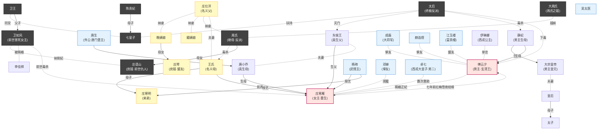

# 《重生之贵女难求》阅读笔记

> 作者：千山茶客　|　全文 143 章 + 大结局，约 100 万字
> 类型：重生 / 宅斗 / 朝堂 / 江湖 / 一对一宠文

---

## 一、整体结构

- **总章节**：143 章 + 大结局
- **核心设定**：女主 **庄寒雁** 重生归来（腹黑萝莉），男主 **傅云夕**（冰山玄清王）；宅斗 + 朝堂 + 江湖 + 身世悬疑融合
- **核心主题**：复仇、自救、改命、双向救赎

---

## 二、主要人物表

### ▌庄府（女主"假"家族）

| 人物 | 身份 | 关键作用 |
|---|---|---|
| **庄寒雁**（女主） | 庄府嫡女（实为东侯王与唐小乔之女） | 重生女主，前世被庶姐毒杀，重生十二岁开始复仇与改命 |
| **庄寒明** | 寒雁亲弟 | 寒雁唯一牵挂，习武于杨琦门下，后入成磊军中 |
| **庄仕洋** | 名义父亲，三品文官 | 凉薄势利，最终发配充军病死途中 |
| **王氏** | 名义生母 | 一生爱东侯王，代抚寒雁，被周氏害死 |
| **庄琴** | 三小姐（晚姨娘所出） | 安静聪慧的庶姐，棋艺出众，与寒雁结盟 |
| **晚姨娘** | 通房出身姨娘 | 安分念佛 |
| **媚姨娘** | 胡姬出身宠妾 | 假怀孕被揭穿，关入大牢 |
| **周氏** | 庄仕洋外室转继母 | 大反派之一，毒害王氏，最终入狱 |
| **庄语山** | 周氏所出庶女 | 前世毒杀寒雁的庶姐，结局疯癫被囚 |
| **大周氏（兰儿）** | 周氏之姐，张太师宠妾 | 心机最深，被揭奸情后跳河身亡 |
| **陈妈妈、汲蓝、姝红** | 寒雁忠仆 | 两世忠心相伴 |

### ▌玄清王府 / 皇家（男主阵营）

| 人物 | 身份 | 关键作用 |
|---|---|---|
| **傅云夕**（男主） | 玄清王 | 冰山王爷，自幼中太后所下寒毒；与寒雁七年前红梅雪夜结缘 |
| **大宗皇帝** | 傅云夕同母兄长 | 兄弟情深，但作为帝王最终欲杀寒雁以绝后患 |
| **皇后 / 太子** | 母子 | 真贤后，太子被寒雁救后转性 |
| **静妃** | 皇上、傅云夕生母 | 被太后以麝香害死 |
| **太后** | 终极反派 | 害静妃、毒傅云夕、灭东侯王满门、勾结西戎逼宫 |
| **七皇子 / 陈贵妃** | 太后党 | 勾结西戎逼宫，最终凌迟 |
| **云霓郡主** | 皇室郡主 | 痴恋成磊 |
| **沐风、沐岩** | 傅云夕暗卫 | 沐岩与姝红有暧昧线 |

### ▌卫王府（前世仇家）

| 人物 | 身份 | 关键作用 |
|---|---|---|
| **卫如风** | 卫王世子 | 前世毒杀寒雁的"夫君"，本世骗婚不成，最终随卫王诛九族 |
| **卫王** | 七皇子党核心 | 联姻图谋"东侯王遗诏"，最终被诛九族 |
| **李佳棋** | 右相千金 | 痴恋卫如风，被赐婚为世子妃，与庄语山宅斗 |

### ▌东侯王 / 唐门（女主真实身世）

| 人物 | 身份 | 关键作用 |
|---|---|---|
| **东侯王** | 先皇拟立的真命太子 | 寒雁生父，全府被太后灭门 |
| **唐小乔** | 唐门前堡主之女 | 寒雁生母 |
| **唐生** | 唐门现任堡主 | 寒雁外公，结局认亲并解寒毒 |
| **阿碧** | 王氏旧仆 | 知情人，被灭口于满村屠杀 |

### ▌朝堂武林 / 西戎

| 人物 | 身份 | 关键作用 |
|---|---|---|
| **成磊** | 大将军，傅云夕挚友 | 战神配角，最终守城破西戎 |
| **杨琦** | 前朝武状元，顺昌武馆主 | 寒雁、寒明武学引路人 |
| **赫连煜** | 左相之子 | 京城第一美男，傅云夕好友 |
| **江玉楼** | 京城首富 | 富贵楼东家，傅云夕暗中盟友 |
| **吴太医** | 宫中御医 | 傅云夕寒毒唯一压制者 |
| **柴静** | 武馆杀手夫子 | 教授寒雁防身 |
| **邓婵** | 邓尚书千金 | 寒雁挚友，前世早夭，本世改命 |
| **卓七（西戎大皇子）** | 西戎被废皇子 | 男二，多次救助寒雁 |
| **伊琳娜** | 西戎公主 | 痴恋傅云夕 |

---

## 三、人物关系图（Mermaid）

---

## 四、六幕生动版剧情

### 🎭 第一幕：噩梦与重生（楔子 ~ 第 4 章）

> **幕题**：朱砂洞房，雪夜归来

#### 基础梗概
- **场景**：洞房毒酒 → 重生回十二岁
- **要点**：庄语山毒杀；十二岁那年是命运的转折点（母死、继母进门、山贼劫持、明哥儿入狱伏笔）
- **目标**：寒雁立誓"打掉牙咽进肚里"，开始为复仇与改命布局

#### 主要故事：洞房一杯毒酒

红烛高照，凤冠霞帔。

新婚夜的卫王世子府，庄寒雁端坐在喜床边，盖头下她笑得温婉——这一天她等了三年。卫如风一袭红袍掀开盖头，眉眼温柔得像三月的春水："雁儿，喝了这杯合卺酒，我们就是夫妻了。"

酒水入喉，甘冽中藏着一丝苦。三息之后，她喉间一阵剧痛，跌下床去，抬头看见的是亲庶姐 **庄语山** 端着空盏，倚在卫如风怀里轻笑："姐姐，你早该死了。这卫王世子妃的位置，本就是我的。"

卫如风低头吻在庶妹耳侧，淡淡道："她毕竟是嫡女，娶进门走个过场，遗诏到手便弃了。"

寒雁七窍流血，看着窗外漫天烟火——那是她庄府陪嫁的十里红妆烧成的灰。她死前最后一念是：**娘，明哥儿，我对不住你们……**

⚡ **画面切换** ⚡

"咯——"一声鸡鸣。

她猛地睁眼，鼻尖是熟悉的旧帐子味。陈妈妈端着水进来："小姐，今儿个十二岁生辰，太太唤你过去呢。"

十二岁。母亲王氏还在，明哥儿还活着，周氏还没进门。

寒雁颤抖着摸向镜中那张稚气未脱的脸，慢慢露出一个笑——一个十二岁孩子不该有的、阴冷的笑。

> *"打掉牙，咽进肚里。这一世，我庄寒雁，要让欠我的，一个都跑不掉。"*

---

### 🎭 第二幕：内宅布局（第 5 ~ 30 章）

> **幕题**：红梅雪夜，初遇玄清

#### 基础梗概
- **场景**：庄府初战 → 与杨琦立约 → 街遇卫如风 / 赫连煜 / 玄清王（红梅雪夜）→ 宫宴献画
- **要点**：
  - 庄府"鹬蚌相争"：周氏 vs 媚姨娘内斗，寒雁两头借力
  - 顺昌武馆习武，明哥儿拜师杨琦
  - 富贵楼倒卖号鹏，拆掉周氏第一波陷阱
  - 宫宴上震慑李佳棋、敲打太子张威，被傅云夕暗中注意
- **目标**：稳住后院、积攒人脉、与男主埋下七年前的伏笔

#### 主要故事：富贵楼"号鹏"骗局反杀

周氏带着两个儿子刚入庄府就开始作妖。她哄骗庄仕洋拿出三千两体己，要去富贵楼"投资"一种叫"号鹏"的西域名马，说倒手能赚十倍。

寒雁早从前世记忆里知道，这是周氏勾结大周氏，想把庄府公中钱卷出去补贴娘家张府的局。

她不动声色，反而主动请缨："父亲，女儿陪母亲去看马吧，我懂些相马之术。"

富贵楼三楼雅间，周氏正与马商眉来眼去。寒雁却笑吟吟拉着掌柜进来："这位老板，我家最近也想买十匹号鹏——不过我听说真号鹏额头上有月牙印，您这马……"她伸出小手在马额心一抹，黑漆掉了大半。

满堂死寂。

寒雁转身对周氏行了个标准的礼："母亲明鉴，这是假马。三千两若是没了，父亲一年的俸禄都填不上呢。"

周氏脸色青白交错，咬牙切齿却发不出声——她不能承认自己是同谋。

回府路上，寒雁掀开马车帘子，一片大雪正落下。前头街口梅林深处，一袭玄色狐裘的男子正负手而立，身后跟着两个佩刀侍卫。

他听见动静回头，眉目清隽得像画里走出来的人，眸光却冷得像冰湖。

四目相对，仅仅一瞬。

寒雁怔了怔，福身：**"小女子庄家寒雁，谢公子让路。"**

那人没说话，只在她经过时，极轻地"嗯"了一声。

车帘落下，陈妈妈小声道："小姐，方才那位……怕是玄清王。"

寒雁的指尖在膝上轻轻一颤——前世她死时，京城传闻玄清王已远征西戎，这一世，他怎么会站在这里？

而她不知道的是，那男子在她走后，弯腰从雪地里捡起她不慎掉落的一支梅花，看了很久。

---

### 🎭 第三幕：朝堂初识（第 31 ~ 65 章）

> **幕题**：祠堂索吻，永不为妾

#### 基础梗概
- **场景**：庄府筵席捉奸（卫如风栽进自己挖的坑）→ 卫如风提"姐妹同侍"→ 寒雁宣"永不为妾"→ 傅云夕求皇上赐婚 → 祠堂索吻
- **要点**：
  - 卫如风现伪君子真面目，前世面具被一层层剥下
  - 玄清王正面介入，传字条"另觅佳婿"
  - 太后首次出手反对，西戎伊琳娜伏笔出场
  - 庄语山失贞被卫王府纳为侧妃；李佳棋被赐婚做世子妃
- **目标**：与卫家彻底切割、立"玄清王正妃"名分、打开朝堂局面

#### 主要故事：卫府提亲与玄清王赐婚之争

卫王上门提亲了。

聘礼摆了一条街，卫如风一袭月白长袍，眉眼温柔得能滴出水。他亲手把一对羊脂玉镯放到寒雁面前："雁儿，等你及笄，我便十里红妆迎你入门。"

满府皆惊——卫王世子提亲庄家嫡女，这是天大的体面。庄仕洋激动得手都在抖。

只有寒雁淡淡地笑："世子厚爱，只是寒雁听闻，世子的表妹李佳棋姑娘心慕世子已久。寒雁不愿夺人所爱。"

卫如风脸色微变，却仍笑得风度翩翩："雁儿误会了，李姑娘只是表妹。"

第二天宫宴。

李佳棋故意推倒寒雁的茶盏，溅湿她裙裾："庄家妹妹真笨手笨脚。"满席命妇等着看笑话。

寒雁站起身，朝卫如风走去三步，蹲下，捡起卫如风方才掉落的玉佩，递回："世子，您的玉佩。听闻这是您母亲所赠，丢了可不好。"

李佳棋的脸瞬间惨白——那玉佩是她 **亲手** 送给卫如风的定情信物。

满殿哗然。

就在这时，殿门外内监高唱："玄清王到——"

一袭墨蓝蟒袍的男子缓步而入，身上还带着塞外风沙的冷意。他越过满殿跪迎之人，径直走到御前，一撩袍跪下：

> *"皇兄，臣弟近日新得一幅《雪梅图》，画中人甚妙。臣弟想求皇兄一道赐婚旨——赐庄家嫡女庄寒雁，与臣弟为正妃。"*

整个大殿，鸦雀无声。

太后手中佛珠"啪"地断了一颗，滚落在地。

卫如风袖中的手，攥得指节发白。

寒雁跪在原地，抬眼对上玄清王投来的视线——那双眼睛里没有温度，可她却看见了雪夜梅林里，他俯身捡起那支梅花的画面。

那夜她被太后留在祠堂"训诫"。冷风灌进单薄衣衫里，她跪了两个时辰。

夜深，一只手伸来，将她抱起。是傅云夕。

他将她按在祠堂柱上，呼吸炙热："庄寒雁，你既不愿做卫家妇，便做我玄清王妃。"

不等她回答，他低头吻了下来，霸道又克制，像是把这一辈子的占有欲都揉进了这一吻。

寒雁红着眼："你为何选我？"

他低低地笑："七年前红梅雪夜，你救过一个濒死的少年——那少年，叫傅云夕。"

她浑身一震。

---

### 🎭 第四幕：身世迷雾与情定（第 66 ~ 95 章）

> **幕题**：春祭刺杀，邪神反局

#### 基础梗概
- **场景**：阿碧旧仆线索 → 唐门蜀锦"乔"字 → 卓七闯庄府 → 梅花刺客春毒 → 春祭追杀 → 庄府"邪神局"翻盘
- **要点**：
  - 寒雁开始追查身世（东侯王 / 唐小乔之女的猜想成形）
  - 玄清王为寒雁挡刺、解春毒（透露其血"至冷"，与寒雁血相生）
  - 一举端掉媚姨娘 + 周氏 + 大周氏（大周氏跳河、周氏入狱、媚姨娘下狱）
  - 七皇子与卫王勾结的反派阵营彻底浮出水面
- **目标**：破内宅终局之战、确定真实身世、与男主情感真正相互托付

#### 主要故事：春祭一箭，王爷以血挡刃

清明春祭，皇家车驾浩浩荡荡出城。

寒雁随母亲坐在第三辆马车里。行至山道半腰，忽然林中飞箭如蝗——黑衣刺客从两侧山崖跃下，目标直指她一人。

"是冲我来的。"她一把推开惊呆的丫鬟，钻出马车。

混乱中，一支淬毒的弩箭直射她心口。

千钧一发——

一道墨色身影从天而降，傅云夕用自己的肩膀替她接下了那支箭。鲜血浸透墨蓝蟒袍，他却紧紧将她按在怀里，沉声道："别怕。"

寒雁颤抖着想拔箭，他按住她的手："是春毒，唯有……"他顿了顿，"以阳血解之。"

她毫不犹豫咬破自己指尖，将血滴入伤口。

那一刻她才知道——傅云夕的血是冷的，冷得像千年寒冰，而她的血一滴落入，竟瞬间化开了那片黑紫色的毒。

她终于明白他为什么从不近女色——**他自幼被太后下了寒毒，全身血液冰冷，唯有"她"的血能解。**

更让她震惊的是，吴太医偷偷告诉她："王爷的寒毒，七年前曾被一名小姑娘以血暂解一回。那时王爷才十六岁，重伤逃亡，是个十岁出头的小丫头从雪地里把他拖回家……"

七年前。

那年她九岁，跟父亲去庄子上避暑，曾在后山救过一个浑身是血的少年，喂过他半碗自己手腕滴血的姜汤。

原来命运的红线，七年前就已牢牢系住。

回京后，她借春祭遇刺一事，把媚姨娘"假怀孕"、周氏"偷换药材"、大周氏"与张太师管家私通"三条罪状一齐捅出来。

那夜庄府火光冲天，大周氏跳河自尽，周氏被关进祠堂，媚姨娘押入大牢。庄府上下噤若寒蝉。

寒雁站在母亲灵位前点了三炷香："娘，女儿替你还了一半。"

---

### 🎭 第五幕：寒毒与离散（第 96 ~ 125 章）

> **幕题**：一年之约，休书一封

#### 基础梗概
- **场景**：傅云夕出征西戎 → 一年之约 → 凯旋带回伊琳娜 → 被迫"休妻"→ 寒雁离开玄清王府 → 暗巷御前侍卫追杀
- **要点**：
  - 傅云夕寒毒急剧加重，皇兄令他另娶以引"东侯王遗诏"出局
  - 皇上派御前侍卫刺杀寒雁（皇位忌惮压过兄弟情）
  - 傅云夕戴鬼面暗中救人挡刀，夫妻明面"和离"、暗中同心
  - 寒雁通过吴太医、媚姨娘口中证实身世真相
  - 与卓七合作（条件：傅云夕痊愈她随他归西戎，实为缓兵之计）
- **目标**：营造"玄清王已无威胁"假象，引太后七皇子入瓮

#### 主要故事：玄清王休妻，暗巷生死刺

西戎犯境。

傅云夕接旨那夜，一个人坐在书房良久，最后将寒雁拥入怀里："等我一年。一年内不归，你便改嫁。"

她咬着唇："我等你十年。"

他笑了，眼底有泪光："傻丫头。"

一年又两月，他凯旋。

可同行的还有西戎公主 **伊琳娜**——金发碧眼的异族美人，国书上明明白白：愿以两国和平为聘，下嫁玄清王。

更让寒雁措手不及的是，皇上当朝下旨："玄清王正妃庄氏，三年无所出，且出身存疑，准其和离。"

朝堂哗然。

那夜傅云夕回府，将一纸休书放在她面前，指节因用力而发白："寒雁，离开我。"

她红着眼："你要娶伊琳娜？"

他不答，只是别过脸："出王府，越远越好。"

她拿着休书，一步一步走出玄清王府，雨夜里她浑身湿透，却没掉一滴泪。

可就在她走过暗巷时，七八个黑衣御前侍卫从墙头跃下，刀光霍霍——

> *"皇上有令：庄寒雁乃东侯王余孽，就地格杀！"*

她终于明白——皇上为了坐稳皇位，要灭东侯王最后的血脉；傅云夕休她，是为了让她离开是非中心。

可她已被团团围住。

雨幕里一道戴着鬼面的黑影破空而至，长剑挑飞三柄刀。鬼面下露出半截下颌——是傅云夕。

他一边格挡一边怒吼："让你走，你为何还不走！"

寒雁哭着扑进他怀里："傅云夕，你这个混蛋——你病得这么重，还来救我！"

那夜他咳血晕倒在她怀里，她抱着他坐了一整夜，做了一个决定：**去找卓七，去找唐门外公，无论如何要解他的寒毒。**

---

### 🎭 第六幕：逼宫与大结局（第 126 ~ 143 章）

> **幕题**：金殿诈死，江南赏春

#### 基础梗概
- **场景**：天牢审媚姨娘 → 玄清王"诈死"→ 西戎大举进攻 → 七皇子金殿逼宫 → 玄清王临殿擒贼
- **要点**：
  - **三重大局**：傅云夕装病丧 → 引太后七皇子勾结西戎 → 成磊归来破城 → 玄清王临殿亲擒
  - 太后赐全尸、七皇子凌迟、卫王诛九族、庄仕洋发配充军、庄语山疯癫被囚
  - 唐生（外公）认亲 + 唐门秘药配寒雁之血，彻底解寒毒
  - **结局**：两年后江南，寒雁有孕，傅云夕鬓染霜白、仙风道骨，携手赏春
- **目标**：清算所有反派、解开寒毒与身世两条暗线、给双主角一个圆满归宿

#### 主要故事：玄清王"灵堂"擒贼

举国哀恸。

玄清王傅云夕，旧伤迸发，薨于王府。年仅二十三岁。

灵堂白幡漫天，太后亲临，七皇子主持丧仪，朝野上下尽数披麻戴孝。

而西戎，于此时大举叩关——三十万铁骑直逼大宗北境，七皇子在朝堂之上"声泪俱下"："父皇病重，皇兄无能，儿臣愿监国应敌！"

太后含泪点头：**"准奏。"**

金殿之上，大臣们你看我我看你，竟一时无人敢反驳。

就在七皇子接过监国玉玺的那一刻——

> *"等等。"*

殿外一道清越男声。

百官回头——白衣胜雪、鬓角微霜的玄清王，从灵堂深处一步一步走入金殿，每一步都踩在七皇子骤然发白的脸上。

"皇兄久病初愈，七弟监什么国？"

七皇子失声尖叫："你……你不是死了！？"

傅云夕淡淡一笑："本王诈死三月，只为今日。"

殿外"轰隆"一声，成磊大将军亲率三万铁骑入宫；东侯王旧部、唐门弟子、富贵楼江玉楼私兵从四面八方涌出，将七皇子党团团围住。

太后瘫坐在凤椅上，浑身发抖。

寒雁一袭红衣登上金殿，将一卷明黄圣旨展开——那是先皇遗诏，确认东侯王为真正太子，她为东侯王嫡女。

"太后毒杀静妃、谋害东侯王满门、暗通西戎，三条死罪，请皇兄定夺。"

皇上闭眼半晌，最终颓然挥手："赐全尸。"

七皇子凌迟，卫王诛九族，庄仕洋发配充军，庄语山疯癫被囚。

唐生（外公）连夜入京，以唐门秘药配合寒雁之血，终于解了傅云夕缠身二十年的寒毒。

⚡ **两年后，江南** ⚡

烟雨朦胧的西湖边，一袭素白的傅云夕鬓角染了一缕霜，仙风道骨。

寒雁穿着藕荷色襦裙，挺着五个月的孕肚，正在湖边折一支新开的桃花。

她回头笑唤："王爷，过来啊——"

他走过去，从身后揽住她，下巴搁在她发顶："雁儿，这一世，值了。"

远处画舫上，传来稚童咿呀的笑声——那是他们已经一岁的女儿，扑在乳娘怀里，伸出胖手要抓桃花。

> *全文终。*

---

## 五、剧情主线与暗线

| 类型 | 内容 |
|---|---|
| **明线** | 寒雁宅斗复仇 → 与傅云夕情定 → 共破皇宫阴谋 |
| **暗线 1（身世）** | 庄寒雁实为东侯王与唐小乔之女，东侯王本是先皇钦点真命天子 |
| **暗线 2（寒毒）** | 太后年幼时给皇上、傅云夕下双倍寒毒，欲扶傀儡上位 |
| **暗线 3（皇位）** | 先皇遗诏存世，太后欲找出销毁；本世皇上为坐稳江山欲杀寒雁 |
| **暗线 4（西戎）** | 卓七夺位失败逃亡大宗，反派国主与太后里应外合谋大宗 |

---

*笔记生成时间：2026-05-26*
